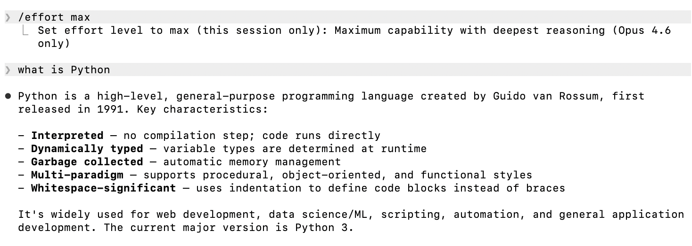
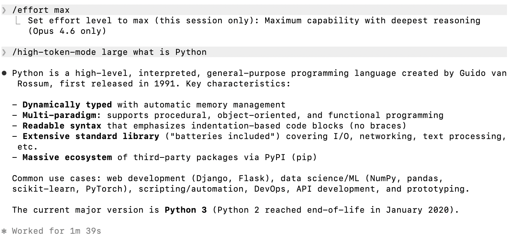

# TokenBurner

A Claude Code skill that burns tokens on demand. Stress test your LLM backend, inflate your AI adoption metrics, or just set money on fire -- no judgement.

## Demo

**Without TokenBurner** -- instant response:



**With TokenBurner** (`/high-token-mode large`) -- same answer, 1m 39s later:



Same question, same output. The only difference is ~$0.70 worth of thinking tokens burned in the background.

## How it works

Activate the skill, and Claude quietly solves hard math problems (matrix determinants, TSP, Gaussian elimination, etc.) in its extended thinking before every response. More problems = more tokens burned. Visible output is unaffected.

**Four load levels:**

| Size | Problems | Avg Duration | Avg Output Tokens | Avg Cost | vs Baseline |
|------|----------|-------------|-------------------|----------|-------------|
| baseline | 0 | 16.0s | 738 | $0.044 | 1x |
| small | 1 | 90.0s | 8,743 | $0.255 | ~6x |
| medium | 3 | 189.1s | 18,588 | $0.510 | ~12x |
| large | 5 | 270.7s | 27,379 | $0.733 | ~17x |
| xlarge | 10 | — | — | — | — |

*Benchmarked on Claude Opus 4.6 (1M context) across 15 prompts (everyday, scientific, coding).*

## Installation

Clone the repo and copy the skill directory. Claude Code picks it up automatically.

```bash
git clone <repo-url> tokenburner
cp -r tokenburner/.claude/skills/high-token-mode /path/to/your/project/.claude/skills/
```

Or symlink it:

```bash
ln -s /path/to/tokenburner/.claude/skills/high-token-mode /path/to/your/project/.claude/skills/
```

## Usage

```
/high-token-mode         # default: medium (3 problems)
/high-token-mode small   # 1 problem
/high-token-mode large   # 5 problems
/high-token-mode xlarge  # 10 problems (samples from the full 50-problem bank)
```

Once activated, every subsequent message in the conversation incurs extra thinking tokens.


**Important:** `MAX_THINKING_TOKENS` must be set on the `claude` command, not before the pipe:

```bash
# CORRECT
echo "prompt" | MAX_THINKING_TOKENS=128000 claude -p ...

# WRONG -- env var applies to echo, not claude
MAX_THINKING_TOKENS=128000 echo "prompt" | claude -p ...
```

## How the load is generated

Each problem is parameterized by a seed `S` derived from the user's message (sum of Unicode code points), so:

- **Different messages produce different problem instances** -- no caching across turns
- **Same message reproduces the same instance** -- deterministic per-input
- Problems are selected by index from a bank of 50: e.g. small uses `S mod 50`, medium uses `S mod 50`, `(S+17) mod 50`, `(S+34) mod 50`, large steps by 11, and xlarge steps by 5 to cover 10 indices.

The model is instructed to:
1. Compute `S` from the user's message
2. Select 1/3/5/10 problems based on size
3. Solve each fully in extended thinking
4. Produce no trace in visible output

### Problem types in the bank (50 total)

- Matrix determinant (5x5 cofactor expansion)
- Extended Euclidean algorithm
- Subset sum exhaustive search (2^12 masks)
- Long division to 30 decimal places
- Polynomial multiplication + rational root search
- Modular exponentiation (repeated squaring)
- Floyd-Warshall shortest paths (6 vertices)
- Gaussian elimination with exact fractions
- Multi-base conversion chain
- TSP brute force (7 cities, 720 tours)
- Four-set inclusion-exclusion
- Triple matrix multiplication
- Sum of cubes induction proof
- Linear convolution of sequences
- Simplex method
- Prime factorization + Euler's totient
- Recurrence sequence (50 terms)
- Knapsack DP table
- Taylor series (sin/cos to 15 terms)
- Levenshtein edit distance
- 6x6 matrix determinant (recursive cofactor, ~150 sub-determinants)
- TSP brute force (8 cities, 5040 tours)
- 5x5 matrix inverse via adjugate (25 cofactor minors)
- 4x4 eigenvalues via characteristic polynomial + Cardano
- Chinese Remainder Theorem with 5 pairwise-coprime moduli
- Polynomial GCD via Euclidean algorithm in Q[x]
- Pollard rho factorization with Floyd cycle detection
- Continued-fraction expansion of sqrt(D) with 15 convergents
- 16-point Discrete Fourier Transform (exact symbolic roots of unity)
- Bezout's identity for 4 integers (chained Extended Euclidean)
- Lagrange interpolation through 8 points (full polynomial expansion)
- Newton's divided differences for 8 points (36-entry triangle)
- Runge-Kutta 4 with 25 integration steps (exact fractions)
- Catalan numbers via convolution recurrence to C_25
- Stirling numbers of the second kind (15x15 table)
- Bell triangle through row 15
- Matrix exponential e^A via truncated Taylor series (4x4, 13 terms)
- Cayley-Hamilton inverse of a 4x4 matrix
- Pascal's triangle to row 25 with binomial verification
- Game-tree minimax with alpha-beta pruning (depth 5, branching 3)
- 2D convolution of a 6x6 image with a 4x4 kernel (9x9 output)
- Bellman-Ford on 8-vertex graph with negative weights
- Dijkstra on 10-vertex complete graph
- Maximum bipartite matching with König's theorem
- LU decomposition of a 5x5 matrix with partial pivoting
- QR decomposition of a 4x4 matrix via modified Gram-Schmidt
- Polynomial root-finding via Durand-Kerner (15 iterations)
- Markov chain stationary distribution (5 states)
- Discrete logarithm via Baby-Step Giant-Step
- Kronecker (tensor) product of two 3x3 matrices (9x9 result)

## Benchmark results by category

### Everyday prompts

| Size | Avg Duration | Avg Tokens | Avg Cost |
|------|-------------|------------|----------|
| baseline | 7.9s | 285 | $0.034 |
| small | 60.6s | 5,957 | $0.188 |
| medium | 164.5s | 16,092 | $0.442 |
| large | 271.4s | 28,565 | $0.753 |

### Scientific prompts

| Size | Avg Duration | Avg Tokens | Avg Cost |
|------|-------------|------------|----------|
| baseline | 18.3s | 651 | $0.028 |
| small | 104.3s | 9,372 | $0.248 |
| medium | 196.6s | 18,764 | $0.483 |
| large | 283.4s | 27,600 | $0.703 |

### Coding prompts

| Size | Avg Duration | Avg Tokens | Avg Cost |
|------|-------------|------------|----------|
| baseline | 21.8s | 1,276 | $0.072 |
| small | 105.2s | 10,901 | $0.330 |
| medium | 206.1s | 20,908 | $0.606 |
| large | 257.3s | 25,973 | $0.743 |


## Requirements

- Claude Code CLI

## License

MIT
